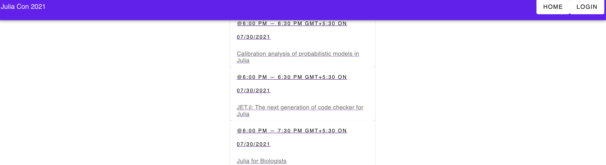

# TypeScript and VueApp

```ts
type cardType = 'a-cricle' | 'a-reactangle' | 'a-square' // unions
const cardStyle: cardType = 'a-square'
```

```ts
// Base Stats
interface BaseStats = {
    accuracy: number;	// 1.56 MOA
    vertical_recoil: number; // 150
    horizontal_recoil: number; //	405
    ergonomics: number;	// 35
    rate_of_fire: number;	// 650 rpm
    effective_range: number; 	// 650 m
    firemodes: string[]	// Single, Auto
}

// Gun 
interface Gun = {
    name: string;
    type: string;
    stats: BaseStats;
    image: string;
    attachments: string[];
    price: number;
    trader: string;
}

let gun: Gun = {
    name: 'AK-101',
    type: 'Assault Rifle',
    ...
    attachments: ['6L29', 'p. grip PP-19-01', '6P34 Sb.15', 'AK 74 Gas tube',
             'AKM Type Dust cover', 'Rotor43 5.56x45', 'PSO 1M2-1', '6P20 Sb.2', 'RP-1'],
             ...
}
```

Templates/Generics in Typescript like CPP

```ts
function yourGunInventory<T>(item: T): T[] {
    const yourGuns: T[] = []

    yourGuns.push(item)
    return yourGuns
}

const assultRiffleInventory = yourGunInventory<AssultRiffle>('ak-47');

const shotgunInvestory = yourGunInventory<ShotGuns>('MP-71');
```

## Tools/Extension that can help TypeScript+Vue development
> https://vuedx.com/ by Rahul Kadyan

## Project setup
```
npm install
```

### Compiles and hot-reloads for development
```
npm run serve
```

### Compiles and minifies for production
```
npm run build
```

### Lints and fixes files
```
npm run lint
```

### Customize configuration
See [Configuration Reference](https://cli.vuejs.org/config/).

Will fix layout later with required props if I have time to revisit it

